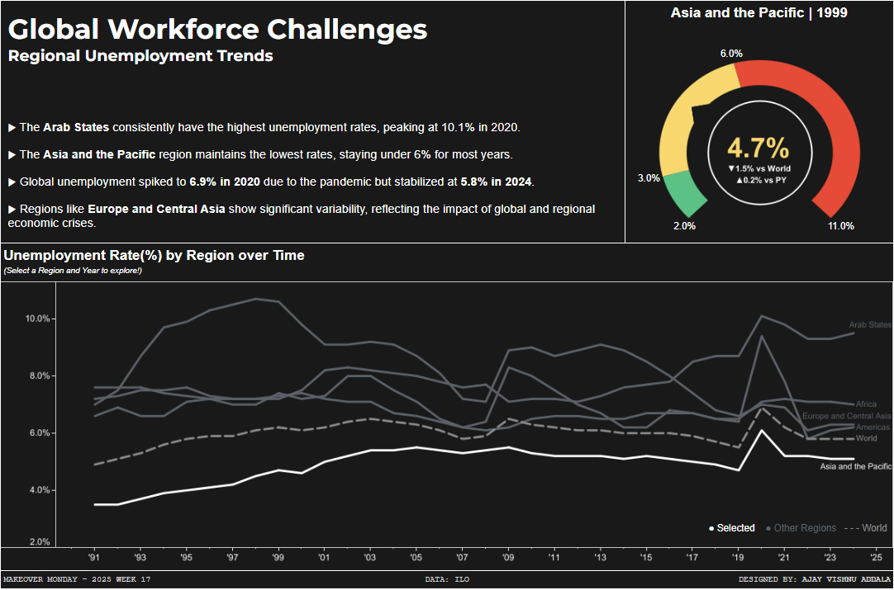

# Global Unemployment Dashboard

This Tableau dashboard visualizes global unemployment trends from 1991 to 2024 across various regions, offering insights into regional disparities, global crises, and progress over time.

## Dashboard Features

- **Interactive Line Chart**: Displays unemployment trends by region with a global trend line for comparison.
- **Dynamic Gauge Chart**: Viewers can select a specific region and year to display the unemployment rate in an engaging gauge chart.
- **Status Classification**: Unemployment rates are categorized as:
  - **Target Met**: 2-3%
  - **Close to Target**: 3-6%
  - **Moderate Distance to Target**: >6%

## Key Takeaways

- The **Arab States** consistently have the highest unemployment rates, peaking at 10.1% in 2020.
- The **Asia and the Pacific** region maintains the lowest rates, staying under 6% for most years.
- Global unemployment spiked to **6.9% in 2020** due to the pandemic but has since stabilized at **5.8% in 2024**.
- Regions like **Europe and Central Asia** show significant variability, reflecting the impact of global and regional economic crises.

## Tableau Dashboard

Explore the dashboard [here](https://public.tableau.com/shared/7GD7T53YZ?:display_count=n&:origin=viz_share_link).

## Dataset

The dataset includes annual unemployment rates by region from 1991 to 2024. Regions covered:
- Africa
- Americas
- Arab States
- Asia and the Pacific
- Europe and Central Asia
- World

## How to Use

1. Select a region from the line chart to explore its trends in detail.
2. Click on a specific year to view the unemployment rate in the gauge chart.
3. Hover over data points for additional details and insights.

---

